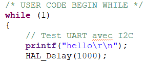
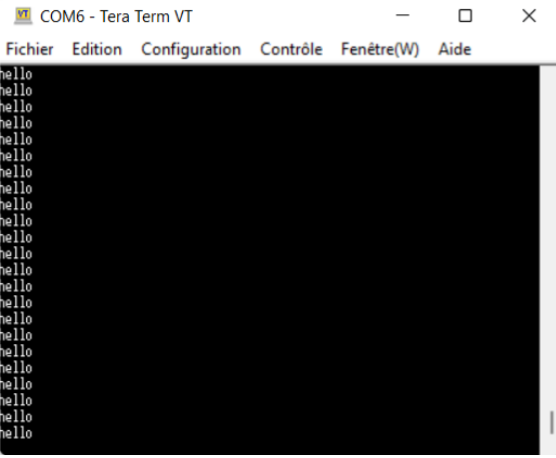

# TP:  Bus et réseaux industriels
### Description
Le but du TP est d'acquérir les données du capteur BMP280 par le STM32 et ensuite de contrôler ces données par une interface API.
La figure suivante illustre l'architecture générale du système :


**Table of Contents**
1. [TP1-Bus I2C](https://github.com/JuanYule/TP_Bus_et_reseaux/blob/main/README.md#tp1-bus-i2c)
2. [TP2-Interfaçage STM32 - Raspberry](https://github.com/JuanYule/TP_Bus_et_reseaux/blob/main/README.md#tp2-interfaçage-stm32---raspberry)
3. [TP3-Interface REST](https://github.com/JuanYule/TP_Bus_et_reseaux/blob/main/README.md#tp3-interface-rest)
4. [TP4-Bus CAN](https://github.com/JuanYule/TP_Bus_et_reseaux/blob/main/README.md#tp4-bus-can)
5. [Conclusion](https://github.com/JuanYule/TP_Bus_et_reseaux/blob/main/README.md#conclusion)


## TP1 Bus I2C
Pour cette première partie, nous avons réalisé l'interrogation des capteurs par le bus I²C du microcontrôleur. L'objectif de cette partie est d'interfacer un STM32 avec des capteurs I²C. Ici, nous avons utilisé le BMP280 qui est un capteur de pression et de température développé par Bosch.


 A partir de la datasheet du capteur BMP280, nous avons determiné les éléments suivants:
 1. Les adresses I²C possibles pour ce composant sont sur 7 bits. Si on connecte la broche SDO au GND, l’adresse du composant est 111 0110 (0x76). Si la broche est connectée à Vddio, c’est 111 0111 (0x77).
 2. Le registre permettant d’identifier ce composant est nommé « id » dont l’adresse est 0xD0. Sa valeur est 0x58 et peut être lue dès que le composant est sous tension.
 3. Le registre permettant de placer le composant en mode NORMAL est le « ctrl_meas» et son adresse est 0xF4. Il faut mettre les bits de valeur 11 dans mode [1 :0].
 4. Les registres contenant l’étalonnage du composant sont à l’adresse 0x88 jusqu'à l’adresse 0xA1.
 5. Les registres contenant la température du composant sont nommés « temp » et sont aux adresses allant de 0xFA à 0xFC. Le format de la donnée est unsigned sur 20 bits, ut[19 :0].
 6. Les registres contenant la pression du composant sont nommés « press » et sont aux adresses allant de 0xF7 à 0xF9. Le format de la donnée est unsigned sur 20 bits, up[19 :0].
 7. Les fonctions permettant le calcul de la température et de la pression compensées en format entier 32 bits sont à la page 45 et 46 de la datasheet.


 ### Setup du STM32

Dans cette sous-partie, nous avons determiné les broches pour configurer le Bus CAN, l'USART2, l'USART3 et la communication I2C. Le bus CAN sert à faire la connexion entre le moteur pas à pas et la carte STM32 :

|Pour la com bus CAN||
| :------------: | :---------------:|
| Rx | PB8 |
| Tx | PB9 |

La communication UART2 sert à faire la connexion entre le port USB de notre ordinateur et la carte STM32 :

|Pour l'USART 2||
| :------------: |:---------------:|
| Rx | PA3 |
| Tx | PA2 |

La communication UART3 sert à faire la connexion entre la raspberry Pi et la carte STM32 :

|Pour l'USART 3||
| :------------: |:---------------:|
| Rx | PC5 |
| Tx | PB10 |

Nous avons choisi pour la communication I2C entre le capteur de température et la STM32 les broches suivantes:

|Pour la cmmunication I2C||
| :------------: |:---------------:|
| SDA | PB7 |
| SCL | PB6 |

Ensuite, nous avons effectué la redirection du printf afin de pouvoir facilement déboguer notre programme sur la STM32. Ainsi, la fonction printf renvoie ses chaînes de caractères sur la liaison UART en USB. Il faut ajouter le code suivant au fichier stm32f4xx_hal_msp.c :

```
/* USER CODE BEGIN PV */  
extern UART_HandleTypeDef huart2;  
/* USER CODE END PV */  

/* USER CODE BEGIN Macro */  
#ifdef __GNUC__ /* With GCC/RAISONANCE, small printf (option LD Linker->Libraries->Small printf    set to 'Yes') calls __io_putchar() */  
#define PUTCHAR_PROTOTYPE int __io_putchar(int ch)  
#else  
#define PUTCHAR_PROTOTYPE int fputc(int ch, FILE *f)  
#endif /* __GNUC__ */  
/* USER CODE END Macro */  


/* USER CODE BEGIN 1 */  
/**  
  * @brief  Retargets the C library printf function to the USART.  
  * @param  None  
  * @retval None  
  */  
PUTCHAR_PROTOTYPE  
{  
  /* Place your implementation of fputc here */  
  /* e.g. write a character to the USART2 and Loop until the end of transmission */  
  HAL_UART_Transmit(&huart2, (uint8_t *)&ch, 1, 0xFFFF);  

  return ch;  
}
/* USER CODE END 1 */  
```

Après avoir ajouté ces lignes dans le code du fichier stm32f4xx_hal_msp.c, nous avons réalisé un printf suivi d'un délai dans la boucle while :



Puis, nous avons ouvert un terminal, lancé et testé le code. Nous avons obtenu le résultat suivant :



Ainsi, la chaine de caractère "hello" s'affichait toutes les secondes dans le terminal.

### Communication I²C avec le BMP280

On utilise les fonctions Transmit et Receive de la bibliothèque HAL pour réaliser la communication I²C. Il faut tout de même faire attention à l'adresse demandée de 8 bits alors que l'adresse I²C est sur 7 bits. Donc il faut décaler l'adresse I²C de 1 vers la gauche lorsqu'on utilise les fonctions HAL.

#### Identification du BMP280
Dans un premier temps, il faut identifier notre capteur en lisant la valeur du registre ID. Pour cela, il faut envoyer l'adresse du registre ID, 0xD0, et recevoir 1 octet correspondant au contenu du registre, 0x58. Nous avons écrit la fonction [id_BMP280()](https://github.com/JuanYule/TP_Bus_et_reseaux/blob/main/TP_Bus_reseaux/Core/Src/main.c#L129) qui réalise ces instructions. Ainsi, on transmet la valeur du registre ID avec la fonction *HAL_I2C_Master_Transmit* et on reçoit son contenu avec la fonction *HAL_I2C_Master_Receive* contenant un tableau d'au moins 1 octet. Si la valeur reçue correspond bien à 0x58, c'est qu'on communique bien avec le capteur. Après avoir lancé le programme, on observe la valeur de l'ID :


Le numéro d'identification du capteur BMP280 est bien 0x58, comme la [documentation](https://github.com/JuanYule/TP_Bus_et_reseaux/blob/main/bst-bmp280-ds001.pdf) l'indique. Nous avons par la suite observé la forme des trames I²C à l'oscilloscope. Les sorties sont en collecteur ouvert, on peut donc voir sur l'oscilloscope que les signaux ne sont pas carrés mais de type RC. C'est-à-dire qu'il y a un temps de montée pour atteindre la valeur à l'état haut. Pour éviter ce comportement et avoir des beaux signaux carrés, il faut ajouter une capacité et une résistance.

#### Configuration du BMP280

Avant de pouvoir effectuer une mesure, il faut configurer le BMP280. Pour cela, nous avons mis en place un mode normal, la pression en oversampling x16 et la température en oversampling x2. Pour écrire dans un registre, il faut envoyer :
* L'adresse du registre où on souhaite écrire
* La valeur à donner au registre

Pour configurer le BMP280, il faut modifier le registre "ctrl_meas" situé à l'adresse 0xF4.


Afin d'avoir la température en oversampling x2, il faut modifier les bits 7, 6 et 5 en fonction du tableau suivant :


Ainsi, il faut mettre les trois bits à 010. Pour avoir la pression en oversampling x16, il faut modifier les bits 4, 3 et 2 en fonction du tableau suivant :


Ces bits valent alors 101. Pour configurer le capteur en mode normal, il faut mettre les bits 1 et 0 à la valeur 11 :


Nous avons donc écrit la valeur 0b01010111 qui vaut 0x57 en hexadécimal dans le registre 0xF4. C'est avec la fonction [configBMP280()](https://github.com/JuanYule/TP_Bus_et_reseaux/blob/main/TP_Bus_reseaux/Core/Src/main.c#L119) que nous avons implémenter l'envoie de l'adresse du registre et sa valeur que nous avons trouvé. Nous avons donc placé ces deux données dans un tableau de 2 valeurs. Puis, nous avons envoyé ce tableau au capteur avec la fonction *HAL_I2C_Master_Transmit*. Enfin, nous avons reçu la nouvelle valeur du registre, 0x57, avec la fonction *HAL_I2C_Master_Receive*.

#### Récupération de l'étalonnage, de la température et de la pression

Après avoir configuré le capteur BMP280, il faut récupérer les données de l'étalonnage et les valeurs de température et de pression. Pour récupérer les données de l'étalonnage, le principe est le même que précédemment. Il faut envoyer l'adresse du registre et ensuite on reçoit l'étalonnage dans un tableau adapté. L'adresse du registre est donnée par la carte mémoire de la [documentation](https://github.com/JuanYule/TP_Bus_et_reseaux/blob/main/bst-bmp280-ds001.pdf) du capteur :


 
C'est le registre *calibration* qui nous intéresse ici et son adresse correspond à l'adresse du premier élément du tableau, 0x88. Dans la fonction [etalonnageBMP280()](https://github.com/JuanYule/TP_Bus_et_reseaux/blob/main/TP_Bus_reseaux/Core/Src/main.c#L140), on transmet donc cette adresse et on reçoit dans un tableau de 26 éléments, les données de l'étalonnage. Enfin, nous avons mis en forme les données d'étalonnage sous la forme suivante pour le calcul de la compensation :


Nous avons effectué des décalages et des casts en mot de 16 bits pour les MSB. Nous avons ensuite effectué une opération binaire OR entre les MSB décalés et les LSB.

#### Calcul des températures et des pressions compensées

Comment on a fait ça ??


## TP2 Interfaçage STM32 - Raspberry
L'objetif principal de ce TP est de configurer les interfaces entre le STM32 et le RaspberyPi 0. La image suivante illustre l'architecture du système.


### Mise en routage du Raspberry PI Zero
En premier temps, nous avons télécharger l'image "Raspberry Pi os" et on l'installé sur la carte SD grace à l'outil BalenaEtcher.

Nous avons changé le nom de notre raspberry pour «raspberrypi6».

### Configuration de l'image
Apres de la installation nous avons crée deux fichier: ssh (fichier vide) et wpa_supplicant.conf nous avons lui  rempli avec le code suivante.

```
ctrl_interface=DIR=/var/run/wpa_supplicant GROUP=netdev
update_config=1
country=FR

network={
 ssid="ese"
 psk="bus_ese"
}
```
Les modifications pour activer les GPIO et pourt configurer la vitesse du port UART du RasberryPi sont étés fait à partir de lignes de commandes suivantes, respectivement.
```
//Dans le fichier config.txt
enable_uart=1
dtoverlay=disable-bt
//Configurtion UART, fichier cmdline on retirer l'option:
console=serial0,115200
```
Notre adresse IP est 192.168.88.247 et à partir d'elle nous pouvons se connecter avec des protocols SSH. La commande suivante montre la manière avec laquelle on se connecte à la raspberry. ``` ramos@192.168.88.247 ```
D'apres que nous avons connectés, on execute les commandes suivantes pour mettre à jour des paquets, l'installaion de pyserial et l'installaction de minicom.
```
sudo apt update 
pip3 install pyserial
sudo apt install minicom   
```
### Script en Python pour se communiquer avec le STM32

Nous avons realiser deux fichiers qui permettent de se communiquer avec la STM32 [TP_reseaux.py](https://github.com/JuanYule/TP_Bus_et_reseaux/blob/main/interface%20REST/TP_reseaux.py) et [foncions.py](https://github.com/JuanYule/TP_Bus_et_reseaux/blob/main/interface%20REST/fonctions.py). Le premier fichier est un shell qui envoi les caractères lorsqu'on tape le clavier. Le fichier «fonctions.py» est le plus important, car il contient les fonctions pour les protocoles que s'illustrent dans le tableau suivant.

|   Requête du RPi     |   Réponse du STM    | Commentaire |
| :------------: |:---------------:| :-----:|
| GET_T      | T=+12.50_C | Température compensée sur 10 caractères    |
| GET_P      | P=102300Pa |   Pression compensée sur 10 caractères     |
| SET_K=1234 | SET_K=OK   |    Fixe le coefficient K (en 1/100e)       |
| GET_K      | K=12.34000 |   Coefficient K sur 10 caractères          |
| GET_A      | A=125.7000 |    Angle sur 10 caractères                 |

Les request sont definis entre la ligne [67](https://github.com/JuanYule/TP_Bus_et_reseaux/blob/main/interface%20REST/fonctions.py#L67) jusqu'à la ligne [97](https://github.com/JuanYule/TP_Bus_et_reseaux/blob/main/interface%20REST/fonctions.py#L67). D'ailleurs, la fonction pour la transmition des données a été defini entre les lignes [58](https://github.com/JuanYule/TP_Bus_et_reseaux/blob/main/interface%20REST/fonctions.py#L58)-[65](https://github.com/JuanYule/TP_Bus_et_reseaux/blob/main/interface%20REST/fonctions.py#L65). Cette fonction permet d'envoyer un seul caractère à la fois à travers de l'UART. 

Pour la reception des donnees nous avons crée la fonction [receptionRx](https://github.com/JuanYule/TP_Bus_et_reseaux/blob/main/interface%20REST/fonctions.py#L28). Cette fonction permet de recevoir chaque caractère et de les stocker dans une variable.


## TP3 Interface REST
Dans cette partie, nous avons implémenté une interface Web sur Raspberry Pi. Tout d'abord, nous procédons à l'intallation et la vérification du serveur Python.
Nous avons vérifié le hostname de la raspberry dans le fichier /etc hostname et c’est : raspberry6
Puis, nous avons modifié le hostname du fichier /etc/hosts raspberry6 pour avoir le même nom, car nous avions un problème de sudo.

Nous avons créé un profil nommé ramos à partir des commandes ci-dessous et nous nous sommes connectés à celui-ci :
```
sudo adduser ramos
sudo usermod -aG sudo ramos
sudo usermod -aG dialout ramos
```
Pour se déloguer, il faut utiliser les commandes Ctrl + D et pour se déconnecter de la raspberry, il faut utiliser les commandes Ctrl + C. Il faut installer flask directement sur le serveur dans ramos et pas sur ese. Ensuite, nous avons créé un répertoire «interface REST» où tous les fichiers seront stockés. Les bibliothèques suivantes sont été installées à partir des commandes suivantes:
```
pip3 install pyserial
pip3 install flask
```
L'image suivante illustre le nouvel utilisateur sur la Raspberry Pi:


### Premier fichier Web
Nous avons d'abord créé un fichier (hello.py) pour notre premier serveur web de la manière suivante
```
from flask import Flask
app = Flask(__name__)

@app.route('/')
def hello_world():
    return 'Hello, World!\n'
```
Ensuite, à partir de la ligne de code suivante nous initialisons notre serveur. Cette ligne de code permet d'éviter que notre serveur ne fonctionne qu'en loopback.
```
FLASK_APP=hello.py FLASK_ENV=development flask run --host 0.0.0.0
```
La constante ``` FLASK_ENV=development ``` permet de lancer un mode debug.
L'image suivante illustre les adresses pour se connecter au serveur web.


Quand on ouvre un navigateur web et qu’on entre l’adresse publique, on obtient l’affichage suivant :


### Premier routage
Pour faire le premier routage nous avons ajouté les lignes suivantes au fichier hello.py:
```
@app.route('/api/welcome/<int:index>')
def api_welcome_index(index):
    return welcome[index]
```
La figure suivante montre la reponse du serveur quand nous avons ajouté un index à la fin de l'adresse.


#### Questions
1. Quel est le rôle du décorateur @app.route?
Il ajoute une nouvelle branche au chemin initial.
2. Quel est le rôle du fragment <int:index>?
Il permet d’identifier le bit de la chaîne de caractère de la fonction welcome. Donc l’index 0 renvoie “W”. Si on met un index plus grand que la chaîne de caractère, le serveur renvoie une erreur 500 qui correspond à une erreur interne du serveur.

#### REMARQUE
Nous avons pris des réponses de serveur en format JSON car ils sont plus lisibles 

#### Reponse JSON
Nous avons ajouté une réponse JSON à partir de la bibliothèque «jsonify». Elle est accessible après cette ligne de code ```from flask import jsonify```. Cette fonction gère à la fois la conversion en json et l’ajout de l’entête.

#### Erreur 404
Nous avons ajouté un nouveau dossier (templates) dans le dossier de interface REST et à l'intérieur on place le fichier «page_not_found.html». Les lignes de code suivantes sont été ajoutés pour faire l'affichage de l'erreur.
```
@app.errorhandler(404)
def page_not_found(error):
    return render_template('page_not_found.html'), 404
```
#### Méthodes POST, PUT, DELETE
Dans cette partie, Nous avons élaboré les différentes méthodes pour les deux path. Le tabmeau suivant montre ces informations.

|   CRUB     |   Réponse du STM    | Path |Commentaire|
| :------------: | :---------------: |:-----:| :-----: |
| Create   | POST  | welcome/  | Change sentence |
| Retreive | GET   | welcome/  | Return sentence |
| Retreive | GET   | welcome/x | Return letter x |
| Update   | PUT   | welcome/x | Insert new word at position x |
| Update   | PATCH | welcome/x | Change letter at position x |
| Delete   | DELETE| welcome/x | Delete letter at position x |
| Delete   | DELETE| welcome/  | Delete sentece |

L'implémentation de ces fonctions se trouve dans le fichier «hello.py» à partir des lignes [15](https://github.com/JuanYule/TP_Bus_et_reseaux/blob/main/interface%20REST/hello.py#L15) et [26](https://github.com/JuanYule/TP_Bus_et_reseaux/blob/main/interface%20REST/hello.py#L26) pour les path welcome/ et welcome/x, respectivement.

Pour tester le fonctionnement de l'API Rest, nous utilisons l'extention de Mozilla «Open RESTED» pour vérifier chaque requête pour différent Path.
La figure suivante illustre à titre d'exemple la réponse que nous avons obtenu au moment où nous avons fait la requete 'GET'.


Pour conclure ce TP3, nous avons pu vérifier toutes les rêquetes pour chaque Path et nous avons validé ce fonctionnement sur la raspberry Pi.

## TP4 Bus CAN

L'objectif de cette partie est de piloter un actionneur, ici un moteur pas à pas, via un bus CAN. La carte Nucleo STM32L476 est équipé d'un contrôleur CAN intégré mais nous avons besoin d'un Transceiver CAN, ici le TJA1050. Celui-ci permet de faire le lien entre la tension 3,3 V du contrôleur CAN et celle de 12 V de l'actionneur.


### Pilotage du moteur
La carte moteur est un peu capricieuse et ne semble tolérer qu'une vitesse CAN de 500kbit/s. Ainsi, nous avons configuré la communication CAN avec un prescaler de 16 et les segments 1 et 2 à la valeur 2 :


Ce qui nous donne un baudrate donc une vitesse de 500kbit/s. Après avoir fait cette configuration, nous avons effectué un code qui fait bouger le moteur de 90° dans un sens, puis de 90° dans l'autre, avec une période de 1 seconde. Avant tout, le moteur est piloté à partir de deux modes : manuel et par angle. La figure suivante montre le tableau de configuration :


Ainsi, dans un premier temps nous avons fixé la position interne à 0 avec la fonction [config_CAN_set0()](https://github.com/JuanYule/TP_Bus_et_reseaux/blob/main/TP_Bus_reseaux/Core/Src/main.c#L332). Pour cela, on place le moteur pas à pas comme on le souhaite et on met l'identifiant standard, *StdId*, à la valeur 0x62. Nous avons appelé cette fonction une seule fois puis nous l'avons mise en commentaire. La configuration est envoyé au moteur pas à pas via la fonction *HAL_CAN_AddTxMessage*.

Ensuite, nous avons configuré la commande par angle avec la fonction [config_CAN()](https://github.com/JuanYule/TP_Bus_et_reseaux/blob/main/TP_Bus_reseaux/Core/Src/main.c#L320). Dans celle-ci, nous avons donc mis l'identifiant standard, *StdId*, à la valeur 0x61. En plus de tous les autres paramètres, nous avons créé un tableau *aData* de 2 cases avec les valeurs D0 et D1 du tableau précédent. Ces valeurs permettent de commander la valeur et le signe de l'angle souhaité. Comme on veut faire bouger le moteur toutes les secondes, on utilise un timer, ici TIM13, avec une interruption. Dans sa fonction de callback [HAL_TIM_PeriodElapsedCallback()](https://github.com/JuanYule/TP_Bus_et_reseaux/blob/main/TP_Bus_reseaux/Core/Src/main.c#L298), nous avons modifié les valeurs du tableau *aData* pour avoir un angle de 90° donc la valeur 0x5A. A l'aide de la boucle if en commentaire, la première fois qu'on entre dans la boucle, le moteur bouge jusqu'à 90°. La deuxième fois, on écrit la valeur 0 dans le tableau donc le moteur bouge jusqu'à la position 0. Le fonctionnement se répète grâce à la variable *incr* qui vaut 1 pour aller dans le *if* et 0 pour aller dans le *else*.

### Interfaçage avec le capteur

Dans cette sous-partie, il faut faire en sorte que le mouvement du moteur soit proportionnel à la valeur du capteur. Pour cela, nous avons modifié la fonction [HAL_TIM_PeriodElapsedCallback()](https://github.com/JuanYule/TP_Bus_et_reseaux/blob/main/TP_Bus_reseaux/Core/Src/main.c#L298). En effet,on va lire la valeur de la température, la transformer en entier et la mettre dans la case 2 du tableau *aData* pour commander l'angle. Enfin, on envoie le tableau via la fonction *HAL_CAN_AddTxMessage*.

## Conclusion
